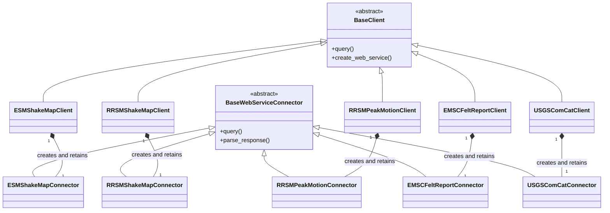
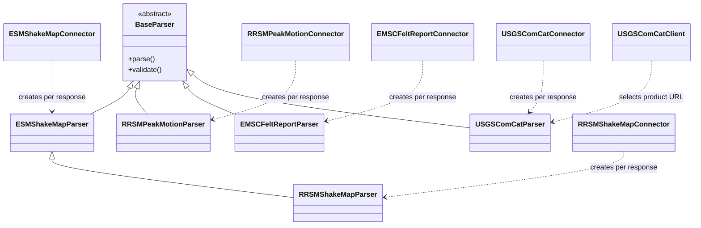
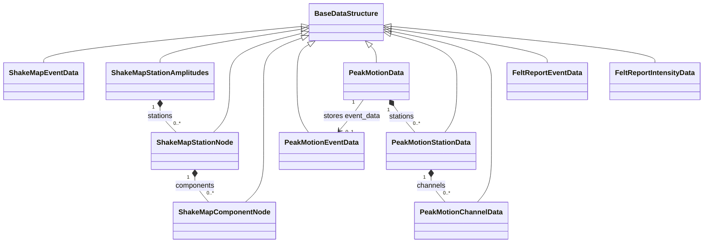

# Developer class diagrams

These diagrams are selective views of the implemented architecture. They omit
most methods and fields so that inheritance, retained objects, and short-lived
dependencies remain visible. In the diagrams:

* `<|--` means inheritance,
* `*--` means an owned nested part,
* `-->` means a retained association without an ownership claim, and
* `..>` means temporary use or creation.

## Public clients and connectors

All five public clients inherit from abstract `BaseClient`. Each concrete
client creates and retains the connector for its provider endpoint. The base
classes show only the operations that define the main request lifecycle.

## Connectors and parsers

Connectors create a parser while handling a successful response and retain the
parsed result, not the parser instance. The dependency arrows therefore denote
temporary creation. `USGSComCatClient` also creates a temporary
`USGSComCatParser` to select exact product-content URLs from parsed event
metadata; product response parsing still belongs to `USGSComCatConnector`.
RRSM ShakeMap inherits the ESM-compatible XML parsing implementation and
overrides only provider-specific error construction.

## Result data models

Every implemented result model extends `BaseDataStructure`. Composition arrows
show the nested model objects stored in collection fields or private lists.
The Peak Motion dataset retains its separately constructed event model through
`set_event_data()`, which is shown as an association rather than composition.
ShakeMap event data is likewise separate from station amplitudes, and Felt
Report event data is separate from felt-intensity data; no direct relationship
between either pair is implied.

The model classes are organized by scientific representation, not by provider.
In particular, ESM, RRSM, and USGS ComCat parsers reuse the established
ShakeMap models, while both EMSC felt reports and USGS ComCat DYFI use
`FeltReportIntensityData`. Felt intensities remain provider-native dictionary
records inside that model rather than instances of `FeltReportEventData`.

